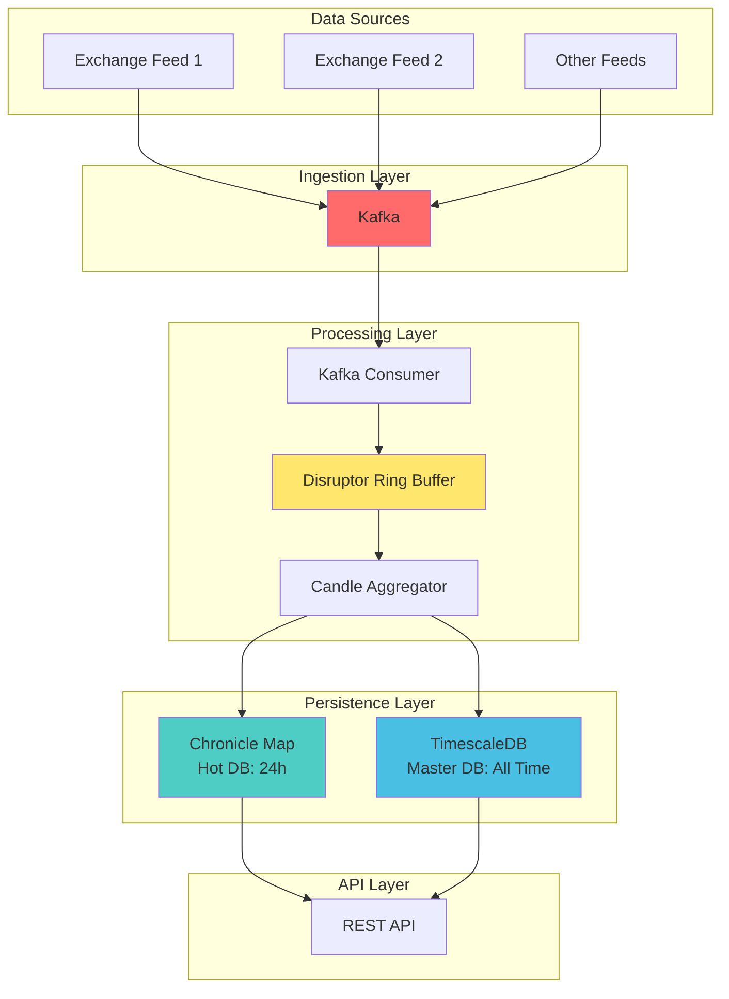
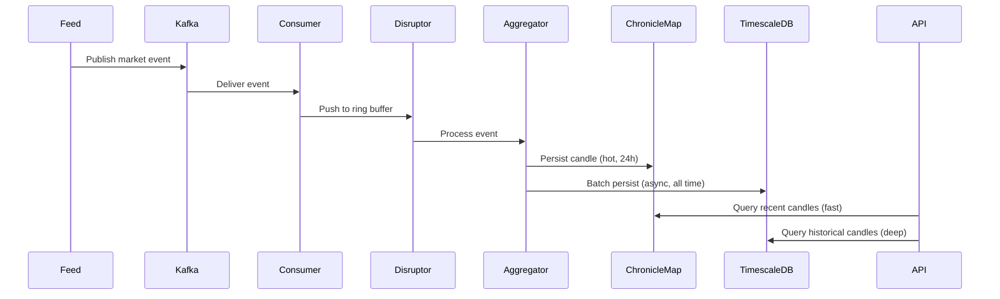

# Hybrid Candle Aggregation Architecture

## Overview
This architecture combines Kafka, LMAX Disruptor, Chronicle Map, and TimescaleDB for scalable, low-latency, and durable candle aggregation.

**Storage Strategy:**
- **Chronicle Map (Hot DB):** Stores last 24 hours of candles in off-heap memory for ultra-fast access and recovery.
- **TimescaleDB (Master DB):** Stores all historical candles for analytics and long-term queries.
- **Recovery:** On restart, Chronicle Map is memory-mapped from disk, restoring the exact state at crash/shutdown.

## Architecture Diagram

## Event Flow

## Improvements Over Traditional Approaches
- **Multi-source support:** Plug in new feeds via Kafka.
- **No latency penalty:** Disruptor and Chronicle Map keep the hot path in-memory/off-heap. TimescaleDB writes are batched and async, so they never block event processing.
- **Durability:** Chronicle Map is memory-mapped to disk and survives restarts with instant recovery. TimescaleDB provides long-term persistence.
- **Crash recovery:** On restart, Chronicle Map reloads the exact state (last 24h of candles) from disk with zero rebuild time.
- **Scalability:** Kafka enables horizontal scaling and high availability.
- **Extensibility:** Add new sources, consumers, analytics easily.

## Data Lifecycle
1. **Real-time aggregation:** Events processed via Disruptor, candles updated in Chronicle Map (hot path, <50μs).
2. **Hot storage:** Chronicle Map stores last 24 hours of candles in off-heap memory for fast queries and crash recovery.
3. **Cold storage:** Candles older than 24 hours are asynchronously batched to TimescaleDB for analytics and long-term retention.
4. **Restart/recovery:** Chronicle Map is memory-mapped, so on restart, all candles from the last 24h are instantly available without rebuild.

## Use Cases
- Real-time candle aggregation from multiple exchanges.
- High-frequency trading analytics.
- Historical data queries and reporting.
