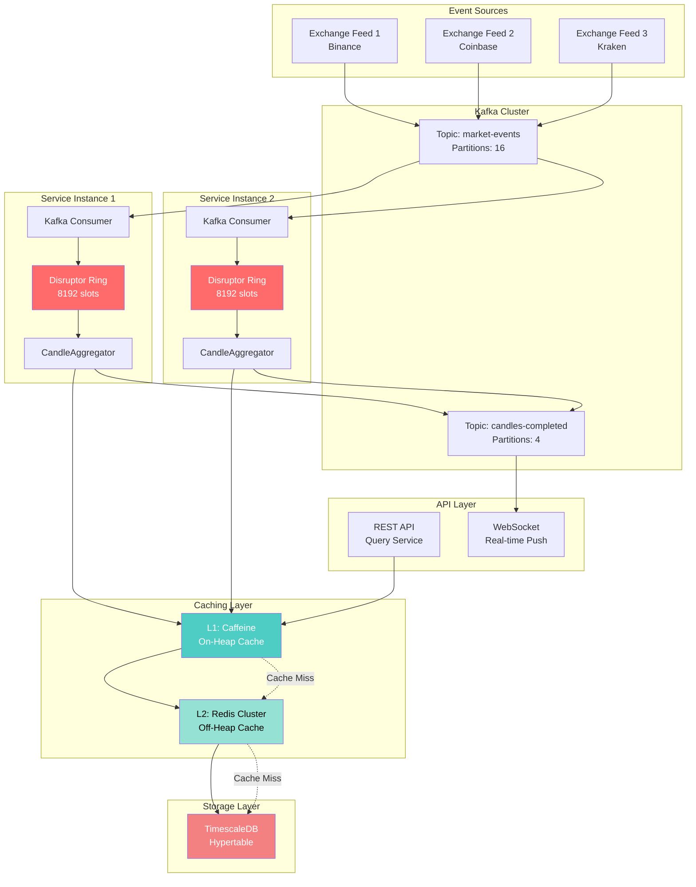

# Kafka + Disruptor + TimescaleDB + Cache Architecture

## Overview

Production streaming architecture combining:
- **Kafka**: Event streaming backbone
- **LMAX Disruptor**: In-memory processing pipeline
- **2-Tier Cache**: L1 (Caffeine) + L2 (Redis) 
- **TimescaleDB**: Persistent time-series storage

---

## Architecture Diagram



---

## Why This Architecture?

### Real-World Examples

**Netflix**
- **Kafka**: Event streaming - user activity, viewing events
- **EVCache**: Multi-tier cache for API responses
- **Cassandra**: Persistent storage

**Uber**
- **Kafka**: Real-time trip events, surge pricing, driver locations
- **Redis**: Geo-spatial cache for driver/rider matching
- **Schemaless**: Trip records and historical data

**Coinbase**
- **Kafka**: Market data distribution, order matching events
- **Redis**: Order book cache, real-time price cache
- **PostgreSQL/TimescaleDB**: Trade history, OHLC candles

---

## Component Breakdown

### 1. Kafka: Event Streaming Backbone

**Purpose:** Decouples producers (exchanges) from consumers (services)

**Configuration:**
```yaml
kafka:
  bootstrap-servers: localhost:9092,localhost:9093,localhost:9094
  consumer:
    group-id: candle-aggregation-group
    auto-offset-reset: latest
    enable-auto-commit: false
    max-poll-records: 500
    fetch-min-bytes: 10240
    fetch-max-wait-ms: 100
  topics:
    market-events:
      partitions: 16
      replication-factor: 3
      retention-ms: 3600000
    candles-completed:
      partitions: 4
      replication-factor: 3
```

**Why Kafka?**
- **Replay:** Can restart service and replay missed events
- **Scalability:** 16 partitions = 16 parallel consumers
- **Durability:** 3 replicas, no data loss
- **Decoupling:** Multiple services can consume same events

---

### 2. LMAX Disruptor: In-Memory Processing

**Purpose:** Low-latency processing within JVM

**Why Keep Disruptor?**
- Pre-allocated ring buffer (zero GC pressure)
- Cache-friendly sequential access
- Lock-free CAS operations
- Event batching for efficiency

---

### 3. Two-Tier Caching Strategy

#### L1 Cache: Caffeine (On-Heap)

**Purpose:** Fast access to active candles

**Configuration:**
- Max size: 10K candles
- TTL: 5 minutes
- Cache key format: `SYMBOL-INTERVAL-TIMESTAMP`

**Access Pattern:**
1. Check L1 (Caffeine)
2. On miss, check L2 (Redis) and promote to L1
3. On miss, query TimescaleDB and populate both caches

---

#### L2 Cache: Redis (Off-Heap, Network)

**Purpose:** Shared cache across multiple service instances

**Configuration:**
```yaml
spring:
  data:
    redis:
      cluster:
        nodes:
          - localhost:7001
          - localhost:7002
          - localhost:7003
      lettuce:
        pool:
          max-active: 20
          max-idle: 10
          min-idle: 5
```

**Why Redis?**
- Shared cache across multiple service instances
- Cluster scalability for millions of keys
- Automatic LRU eviction
- 1-hour TTL for recent historical data

---

### 4. TimescaleDB: Persistent Storage

**Purpose:** Source of truth for all historical data

**Features:**
- Hypertable partitioning (automatic time-based chunks)
- Compression for old data
- ACID guarantees
- Indexed range queries

**Write Strategy:**
1. Async write to TimescaleDB
2. Sync update to L1 and L2 caches
3. Publish completion event to Kafka

---

## Horizontal Scaling Strategy

### Kafka Partitions → Service Instances

```
Topic: market-events (16 partitions)

┌─────────────────────────────────────────────┐
│  Partition 0  →  Service Instance 1         │
│  Partition 1  →  Service Instance 1         │
│  Partition 2  →  Service Instance 2         │
│  Partition 3  →  Service Instance 2         │
│      ...                                    │
│  Partition 15 →  Service Instance 8         │
└─────────────────────────────────────────────┘

Each instance processes 2 partitions
```

**Scaling:**
- Linear scaling up to partition count
- Each instance processes N/total partitions

---

## Cache Coherence Strategy

**Problem:** Multiple service instances updating same candle → cache inconsistency

**Solution 1: Partition Affinity (Recommended)**
```
Symbol BTCUSD → Partition 0 → Instance 1
Symbol ETHUSD → Partition 5 → Instance 2

Each symbol processed by EXACTLY ONE instance
→ No conflicts, no coordination needed
```

**Solution 2: Redis Pub/Sub**
- Broadcast cache invalidation events
- All instances invalidate their L1 cache
- Adds coordination overhead

**Recommendation:** Use Partition Affinity

---

## Configuration Summary

### application.yml
```yaml
spring:
  kafka:
    bootstrap-servers: localhost:9092,localhost:9093,localhost:9094
    consumer:
      group-id: candle-aggregation-group
      auto-offset-reset: latest
      max-poll-records: 500
      properties:
        partition.assignment.strategy: org.apache.kafka.clients.consumer.StickyAssignor
    producer:
      acks: 1
      compression-type: lz4
      batch-size: 16384
      linger-ms: 10
  
  data:
    redis:
      cluster:
        nodes:
          - localhost:7001
          - localhost:7002
          - localhost:7003
      lettuce:
        pool:
          max-active: 20

candle:
  cache:
    l1:
      max-size: 10000
      expire-after-write: 5m
    l2:
      ttl: 1h
      cluster-mode: true
  aggregation:
    disruptor:
      buffer-size: 8192
      wait-strategy: YIELDING
      num-consumers: 4
  storage:
    timescaledb:
      batch-size: 100
      async-write: true
```

---

## Migration Path

### Phase 1: Add Caching
1. Add Caffeine dependency
2. Implement L1 cache in CandleService
3. Monitor hit rate metrics

### Phase 2: Add Redis
1. Deploy Redis cluster
2. Implement L2 cache
3. Coordinate cache invalidation

### Phase 3: Add Kafka
1. Deploy Kafka cluster
2. Implement KafkaConsumer → Disruptor bridge
3. Migrate from MarketDataSimulator to Kafka producer

### Phase 4: Horizontal Scaling
1. Deploy multiple service instances
2. Configure partition affinity
3. Load balance API with nginx/k8s

---

## Monitoring & Metrics

### Key Metrics

**Cache:**
- L1 cache size and hit rate
- L2 cache hit rate

**Kafka:**
- Consumer records consumed
- Poll time
- Consumer lag

**Disruptor:**
- Ring buffer capacity
- Events dropped

---

## Production Checklist

- [ ] Kafka cluster (3 brokers minimum)
- [ ] Redis cluster (3 nodes, sentinel mode)
- [ ] TimescaleDB (already running)
- [ ] Prometheus + Grafana monitoring
- [ ] Circuit breakers (Resilience4j)
- [ ] Rate limiting (API gateway)
- [ ] Load balancer (nginx/k8s ingress)
- [ ] Auto-scaling (HPA based on Kafka lag)
- [ ] Disaster recovery (Kafka topic replication)
- [ ] Alert rules (Grafana/PagerDuty)

---

## References

### Netflix Tech Blog
- Keystone Real-time Stream Processing: https://netflixtechblog.com/keystone-real-time-stream-processing-platform-a3ee651812a
- EVCache Distributed Caching: https://netflixtechblog.com/announcing-evcache-distributed-in-memory-datastore-for-cloud-c26a698c27f7

### Uber Engineering Blog
- Kafka Tiered Storage: https://www.uber.com/blog/kafka-tiered-storage/
- Real-Time Data Infrastructure: https://engineering.linkedin.com/kafka/running-kafka-scale

### Coinbase Engineering Blog
- Scaling Identity: https://www.coinbase.com/blog/scaling-identity-how-coinbase-serves-1-5M-reads-second
- Risk Management with Kafka: https://www.coinbase.com/blog/building-an-in-house-risk-management-system-for-futures-trading

### LinkedIn Engineering Blog
- 7 Trillion Messages/Day: https://www.linkedin.com/blog/engineering/open-source/apache-kafka-trillion-messages
- Running Kafka at Scale: https://engineering.linkedin.com/kafka/running-kafka-scale

### Additional Resources
- Caffeine Cache: https://github.com/ben-manes/caffeine/wiki
- Redis Architecture: https://redis.io/docs/manual/scaling/
- Spring Kafka Documentation: https://docs.spring.io/spring-kafka/reference/html/
