# Candle Aggregation Service

High-performance real-time OHLCV candle aggregation service processing 100K+ events/sec with <50μs p99 latency.

**Tech Stack:**
- Java 21, Spring Boot 3.2 (Virtual Threads)
- LMAX Disruptor 4.0 (lock-free ring buffer)
- TimescaleDB (time-series PostgreSQL)

**Key Features:**
- Multi-interval aggregation (1s, 5s, 1m, 15m, 1h)
- Late event handling (configurable tolerance)
- Persistent storage with ACID guarantees
- TradingView-compatible REST API
- Production-grade metrics (Prometheus/Grafana)

## Quick Start

> For detailed setup instructions, see [QUICKSTART.md](QUICKSTART.md)

### Option 1: Master Launch Script (Recommended)

**Complete end-to-end automated setup:**
```bash
./launch.sh
```

This script handles everything:
- Stops existing services
- Builds the application (Maven clean package)
- Starts TimescaleDB (Docker)
- Launches the service with health checks
- Runs automated verification tests
- Shows performance metrics

### Option 2: Docker

```bash
# Build and start containers
docker-compose up -d --build

# Test API
NOW=$(date +%s)
curl "http://localhost:8080/api/v1/history?symbol=BTCUSD&interval=1s&from=$((NOW-30))&to=$NOW" | jq
```

### Option 3: Manual Local Development

```bash
# Initial setup (installs dependencies, starts TimescaleDB)
./setup.sh

# Start service
./start-service.sh

# Or manual build:
mvn clean package -DskipTests
java -Xmx4g -jar target/candle-aggregation-service-1.0.0.jar
```

## Architecture

**Design Philosophy:** Lock-free concurrency, zero-GC persistence, mechanical sympathy.

> **Deep dives:**  
> [CANDLE_AGGREGATION_EXPLAINED.md](./CANDLE_AGGREGATION_EXPLAINED.md) - Core aggregation algorithm  
> [LMAX_DISRUPTOR_DEEP_DIVE.md](./LMAX_DISRUPTOR_DEEP_DIVE.md) - Lock-free event processing  
> [KAFKA_CACHE_ARCHITECTURE.md](./KAFKA_CACHE_ARCHITECTURE.md) - **Production-scale architecture** (Kafka + Caching)  
> [DATA_GENERATOR_COMPARISON.md](./DATA_GENERATOR_COMPARISON.md) - Market data simulators

### System Design


### Key Components

| Component | Technology | Purpose |
|-----------|------------|----------|
| DisruptorEventPublisher | LMAX Disruptor | Lock-free event pipeline |
| CandleAggregator | AtomicReference CAS | Lock-free OHLC updates |
| TimescaleDBRepository | TimescaleDB/PostgreSQL | Persistent time-series storage |
| REST Controller | Spring WebMVC | Query API |

### Event Flow


### Multi-Interval Processing


### Window Alignment Algorithm

```mermaid
flowchart TD
    Start[Event timestamp:<br/>10:37:23.456] --> Div[Divide by interval<br/>1733529443456 / 60000 = 28892157.391]
    Div --> Floor[Integer division<br/>28892157]
    Floor --> Mult[Multiply back<br/>28892157 × 60000 = 1733529420000]
    Mult --> Result[Window start:<br/>10:37:00.000]
    
    style Start fill:#95e1d3
    style Result fill:#ffe66d
```



### Late Event Decision Tree


### Data Model


### Candle Class Architecture

The system uses **two distinct candle representations** optimized for different purposes:

#### 1. **Candle** (Immutable Record)
- **Location:** `src/main/java/com/fintech/candles/domain/Candle.java`
- **Type:** Java record (immutable by design)
- **Purpose:** Final representation for persistence and API responses
- **Key Features:**
  - Thread-safe (all fields final)
  - JPA entity with TimescaleDB hypertable support
  - OHLC validation in compact constructor
  - Factory method: `Candle.of(time, price)`
  - Helper methods: `isValid()`, `containsTime()`

#### 2. **MutableCandle** (Private Inner Class)
- **Location:** `src/main/java/com/fintech/candles/aggregation/CandleAggregator.java` (line 558)
- **Type:** Private static inner class
- **Purpose:** Working copy during active aggregation (performance optimization)
- **Key Features:**
  - Mutable fields (`high`, `low`, `close`, `volume`) for in-place updates
  - `update(double price)` method (line 621) - zero-allocation mutations
  - `toImmutableCandle()` method (line 642) - conversion to `Candle` record
  - Never exposed outside `CandleAggregator`

**Note:** There is no separate "ImmutableCandle" class - the `Candle` record serves as the immutable representation.

#### Why Two Classes?

**Performance:** Avoid object allocation on the hot path
```java
// ❌ BAD: Creates new object for every price update
candle = new Candle(time, candle.open, newHigh, newLow, newClose, newVolume);

// ✅ GOOD: Mutates existing object in-place
mutableCandle.update(price);  // Zero allocation
```

**Memory Safety:** Mutability confined to aggregator
- `MutableCandle` exists only within `activeCandles` map
- Wrapped in `AtomicReference` for thread-safe updates
- Converted to immutable `Candle` before storage/API responses

#### Transformation Flow


**Lifecycle:** Create → Aggregate (in-place) → Convert → Persist → Query

**Concurrency:** AtomicReference + CAS inside ConcurrentHashMap.compute() lock

### State Management

Two-tier architecture: in-memory (hot path) + persistent TimescaleDB (cold storage)

**Tier 1: In-Memory (CandleAggregator)**

**Location:** `src/main/java/com/fintech/candles/aggregation/CandleAggregator.java`

| Field | Type | Purpose | Thread Safety | Lifecycle |
|-------|------|---------|---------------|-----------|
| `activeCandles` | `ConcurrentHashMap<String, AtomicReference<MutableCandle>>` | Current candles being built | ConcurrentHashMap locks + CAS | Created on first event in window, removed after persistence |
| `eventsProcessed` | `AtomicLong` | Total events processed | Lock-free CAS increment | Monotonically increasing counter |
| `candlesCompleted` | `AtomicLong` | Total candles persisted | Lock-free CAS increment | Monotonically increasing counter |
| `lateEventsDropped` | `AtomicLong` | Late events beyond tolerance | Lock-free CAS increment | Monotonically increasing counter |

**Key:** `activeCandles` key = `"SYMBOL-INTERVAL"` (e.g., `"BTCUSD-M1"`)

**Tier 2: Persistent (TimescaleDB)**

**Location:** `src/main/java/com/fintech/candles/storage/timescaledb/TimescaleDBCandleRepository.java`

| Field | Type | Purpose | Thread Safety | Persistence |
|-------|------|---------|---------------|-------------|
| `entityManager` | `EntityManager` | JPA entity manager for TimescaleDB | Thread-safe (Spring managed) | PostgreSQL hypertable (ACID-compliant) |
| `writeCounter` | `AtomicLong` | Total writes to TimescaleDB | Lock-free CAS increment | In-memory only (reset on restart) |
| `readCounter` | `AtomicLong` | Total reads from TimescaleDB | Lock-free CAS increment | In-memory only (reset on restart) |

**Key:** TimescaleDB composite primary key = `(symbol, interval, time)` (e.g., `('BTCUSD', 'M1', 1733529420000)`)

#### Flow Diagram


#### State Update Operations

**1. Normal Event (Current Window)**
```java
// Step 1: Increment event counter (lock-free)
eventsProcessed.incrementAndGet();

// Step 2: Get or create active candle (ConcurrentHashMap.compute)
String key = "BTCUSD-M1";  // Symbol + Interval
activeCandles.compute(key, (k, atomicRef) -> {
    if (atomicRef == null) {
        // First event for this window
        MutableCandle newCandle = new MutableCandle(windowStart, price, ...);
        return new AtomicReference<>(newCandle);
    } else {
        // Update existing candle (CAS inside updateAndGet)
        atomicRef.updateAndGet(candle -> {
            candle.update(price);  // Mutate in-place
            return candle;         // Return same reference
        });
        return atomicRef;
    }
});

// Step 3: Check if window changed (time-based)
if (newWindowDetected) {
    persistCandle(oldMutableCandle);  // Save to TimescaleDB
    activeCandles.remove(oldKey);      // Clean up old window
    candlesCompleted.incrementAndGet(); // Increment counter
}
```

**2. Late Event (Previous Window)**
```java
// Step 1: Check tolerance
if (eventAge > tolerance) {
    lateEventsDropped.incrementAndGet();
    return;  // Drop event
}

// Step 2: Find existing candle in TimescaleDB
repository.findByExactTime(symbol, interval, windowStart).ifPresent(existing -> {
    // Step 3: Create updated immutable Candle
    Candle updated = new Candle(
        existing.time(),
        existing.open(),
        Math.max(existing.high(), price),
        Math.min(existing.low(), price),
        price,
        existing.volume() + 1
    );
    
    // Step 4: Update in TimescaleDB (JPA merge)
    repository.save(symbol, interval, updated);
    writeCounter.incrementAndGet();
});
```

**3. API Query (Read Path)**
```java
// Step 1: Execute TimescaleDB time-range query
@Query("SELECT c FROM Candle c WHERE c.symbol = :symbol " +
       "AND c.interval = :interval " +
       "AND c.time >= :fromTime " +
       "AND c.time <= :toTime " +
       "ORDER BY c.time ASC")
List<Candle> results = repository.findByRange(symbol, interval, fromTime, toTime);

// Step 2: Increment counter
readCounter.incrementAndGet();

// Step 3: Return results (already sorted by DB)
return results;
```

#### Synchronization Guarantees

| Operation | Synchronization Mechanism | Consistency Guarantee |
|-----------|--------------------------|----------------------|
| `activeCandles.compute()` | ConcurrentHashMap internal lock | Atomic per key |
| `AtomicReference.updateAndGet()` | CAS loop | Linearizable |
| `eventsProcessed.incrementAndGet()` | CAS (lock-free) | Eventually consistent |
| `repository.save()` | PostgreSQL transaction | ACID-compliant write |
| `repository.findByRange()` | PostgreSQL SELECT | Read committed isolation |

**Key Insight:** 
- `activeCandles`: Hot path (100K ops/sec), per-key locks
- `TimescaleDB`: Cold path (candles/sec), ACID transactions, persistent
- Counters: Lock-free CAS, metrics only

#### Memory Layout

```
JVM Heap (4 GB)
├── CandleAggregator instance (~1 KB)
│   ├── activeCandles: ConcurrentHashMap (~100 KB)
│   │   └── ~1000 entries × (String key + AtomicReference + MutableCandle)
│   ├── eventsProcessed: AtomicLong (8 bytes)
│   ├── candlesCompleted: AtomicLong (8 bytes)
│   └── lateEventsDropped: AtomicLong (8 bytes)
│
├── TimescaleDBCandleRepository instance (~1 KB)
│   ├── entityManager: EntityManager (Spring managed)
│   ├── writeCounter: AtomicLong (8 bytes)
│   └── readCounter: AtomicLong (8 bytes)

TimescaleDB (PostgreSQL)
└── candles hypertable (persistent disk storage)
    ├── Automatic time-based partitioning
    ├── Compressed chunks for historical data
    ├── B-tree indexes on (symbol, interval, time)
    └── WAL for durability (ACID compliance)
```

**Design Rationale:**
- Separation: Active (mutable, fast) vs Completed (immutable, persistent)
- ACID guarantees: PostgreSQL transactions ensure data consistency
- Time-series optimizations: Hypertables + compression + partitioning
- Fast queries: B-tree indexes + TimescaleDB query optimizer
- Crash recovery: PostgreSQL WAL ensures durability
- Bounded memory: ~1000 active candles in JVM heap

### Storage Schema

TimescaleDB hypertable with composite primary key:
```sql
CREATE TABLE candles (
    symbol VARCHAR(10),
    interval VARCHAR(5),
    time BIGINT,
    open DOUBLE PRECISION,
    high DOUBLE PRECISION,
    low DOUBLE PRECISION,
    close DOUBLE PRECISION,
    volume BIGINT,
    PRIMARY KEY (symbol, interval, time)
);

SELECT create_hypertable('candles', 'time');
CREATE INDEX idx_candles_lookup ON candles (symbol, interval, time DESC);
```

Examples:
```
('BTCUSD', 'S1', 1733529443000)  → 1-second candle
('ETHUSD', 'M1', 1733529420000)  → 1-minute candle
('XAUUSD', 'H1', 1733529600000)  → 1-hour candle
```

### Thread Model


**Why:**
- Single producer/consumer = No locks in hot path
- Virtual threads = 10K+ concurrent API requests
- Connection pool = Efficient database access
- TimescaleDB = ACID transactions + time-series optimizations

## API Reference

**Endpoint:** `GET /api/v1/history`

| Parameter | Type | Required | Values |
|-----------|------|----------|--------|
| `symbol` | String | Yes | BTCUSD, ETHUSD, SOLUSD, EURUSD, GBPUSD, XAUUSD |
| `interval` | String | Yes | 1s, 5s, 1m, 15m, 1h |
| `from` | Long | Yes | Unix timestamp (seconds) |
| `to` | Long | Yes | Unix timestamp (seconds) |

**Examples:**
```bash
# Last 1 minute of BTC 1-second candles
NOW=$(date +%s)
curl "http://localhost:8080/api/v1/history?symbol=BTCUSD&interval=1s&from=$((NOW-60))&to=$NOW"

# Last hour of ETH 1-minute candles
curl "http://localhost:8080/api/v1/history?symbol=ETHUSD&interval=1m&from=$((NOW-3600))&to=$NOW"

# Last day of Gold 15-minute candles
curl "http://localhost:8080/api/v1/history?symbol=XAUUSD&interval=15m&from=$((NOW-86400))&to=$NOW"
```

Response format (TradingView-compatible):
```json
{
  "s": "ok",           // status
  "t": [1733529600],   // timestamps
  "o": [50000.0],      // opens
  "h": [50100.0],      // highs
  "l": [49900.0],      // lows
  "c": [50050.0],      // closes
  "v": [1234]          // volumes
}
```

## Monitoring

```bash
# Health check
curl http://localhost:8080/actuator/health

# Key metrics
curl http://localhost:8080/actuator/metrics/candle.aggregator.events.processed
curl http://localhost:8080/actuator/metrics/candle.aggregator.late.events.dropped

# Live throughput
watch -n 1 'curl -s http://localhost:8080/actuator/metrics/candle.aggregator.events.processed | jq'
```

## Configuration

> **Generator options:** [DATA_GENERATOR_COMPARISON.md](./DATA_GENERATOR_COMPARISON.md#switching-between-generators)

```properties
# TimescaleDB (PostgreSQL)
spring.datasource.url=jdbc:postgresql://localhost:5432/candles_db
spring.datasource.username=candles_user
spring.datasource.password=candles_pass
spring.jpa.properties.hibernate.dialect=org.hibernate.dialect.PostgreSQLDialect

# Disruptor
disruptor.buffer.size=1024

# Late events
candle.late.event.tolerance.seconds=5

# Market data generators
candle.simulation.simple-mode=false           # MarketDataSimulator (disabled)
candle.simulation.production-scale=true       # ProductionScaleDataGenerator (enabled)
candle.simulation.events-per-second=100000    # Target throughput
candle.simulation.symbols=BTCUSD,ETHUSD,SOLUSD,EURUSD,GBPUSD,XAUUSD
```

## Performance

> **Benchmarking guide:** [PERFORMANCE_BENCHMARKING.md](./PERFORMANCE_BENCHMARKING.md)

| Metric | Value |
|--------|-------|
| Event throughput | 100K events/sec |
| Latency (p99) | < 50 μs |
| TimescaleDB INSERT | ~200 μs (batched) |
| TimescaleDB SELECT | ~1-5 ms (indexed) |
| Memory footprint | 4 GB heap + PostgreSQL buffer cache |

**Why TimescaleDB:**
- **ACID Compliance:** Full transactional guarantees, no data loss on crash
- **Time-Series Optimized:** Hypertables partition data by time automatically
- **Compression:** Historical data compressed 10-20x (saves storage costs)
- **Scalability:** Handles billions of candles with continuous aggregates
- **SQL Query Power:** Complex analytics with standard SQL
- **Operational Maturity:** Battle-tested PostgreSQL foundation with proven reliability

## Testing

### Run All Tests with Coverage Report

```bash
./run-all-tests.sh
```

Generates professional HTML report with:
- Test results (327 tests: unit + integration)
- Code coverage (line + branch)
- Execution time
- Visual dashboard

**Report locations:**
- Summary: `target/test-reports/test-summary.html` (auto-opens)
- Coverage: `target/site/jacoco/index.html`

### Manual Testing

```bash
# Unit + integration tests
mvn test

# Specific test suite
mvn test -Dtest=CandleAggregatorTest

# With coverage
mvn test jacoco:report
open target/site/jacoco/index.html
```

## Assignment Requirements → Implementation

### 1. Event Ingestion & Processing

**Implementation:**
- `BidAskEvent` record: `src/main/java/com/fintech/candles/domain/BidAskEvent.java`
- LMAX Disruptor: `src/main/java/com/fintech/candles/ingestion/DisruptorEventPublisher.java`
- Aggregator: `src/main/java/com/fintech/candles/aggregation/CandleAggregator.java`

**Verify:** `mvn test -Dtest=CandleAggregatorTest#testMultipleEventsInSameWindow`

---

### 2. Multi-Interval Candles

**Implementation:**
- Interval enum: `src/main/java/com/fintech/candles/domain/Interval.java`
- Single-pass processing: `CandleAggregator.processEvent()` loops through all intervals
- Epoch alignment: `Interval.alignTimestamp()` ensures consistent windows

**Verify:** `mvn test -Dtest=CandleAggregatorTest#testProcessesAllIntervals`

---

### 3. Late Event Handling

**Implementation:**
- Detection: `src/main/java/com/fintech/candles/util/TimeWindowManager.java`
- Config: `candle.late.event.tolerance.seconds=5` in `application.properties`
- Handler: `CandleAggregator.handleLateEvent()`

**Verify:** 
```bash
mvn test -Dtest=CandleAggregatorTest#testLateEventWithinTolerance
mvn test -Dtest=CucumberTestRunner -Dcucumber.filter.tags="@late-events"
```

---

### 4. Persistent Storage

**Implementation:**
- TimescaleDB Repository: `src/main/java/com/fintech/candles/storage/timescaledb/TimescaleDBCandleRepository.java`
- Composite primary key: `(symbol, interval, time)`
- Performance: ~200μs batched writes, ~1-5ms indexed reads
- ACID compliance: Full transactional guarantees
- Time-series features: Hypertables, automatic partitioning, compression

**Verify:** `mvn test -Dtest=TimescaleDBCandleRepositoryTest`

---

### 5. REST Query API

**Implementation:**
- Endpoint: `GET /api/v1/history` in `src/main/java/com/fintech/candles/api/HistoryController.java`
- TradingView-compatible JSON format
- Params: symbol, interval, from, to (Unix timestamps)

**Verify:** `mvn test -Dtest=HistoryControllerTest`

---

### 6. Monitoring & Metrics

**Implementation:**
- Micrometer + Prometheus: `/actuator/metrics`, `/actuator/health`
- Counters: `events.processed`, `candles.completed`, `late.events.dropped`
- Latency: `event.processing.time` histogram

**Verify:** `curl http://localhost:8080/actuator/health`

## Design Decisions

**Why LMAX Disruptor?**  
Lock-free ring buffer = ~1μs latency vs ~100μs with ArrayBlockingQueue.

**Why TimescaleDB?**  
- **ACID Guarantees:** Full transactional consistency and durability
- **Time-Series Optimizations:** Hypertables automatically partition by time, enabling efficient queries and compression
- **Operational Simplicity:** Standard PostgreSQL tooling, backups, replication, monitoring
- **Scalability:** Handles billions of candles with continuous aggregates and distributed hypertables
- **Query Flexibility:** Complex analytics with SQL (aggregations, joins, window functions, time-bucketing)
- **Production Ready:** Battle-tested database with proven reliability in financial systems (Coinbase, Robinhood)

**Why Lock-Free CAS?**  
AtomicReference compare-and-swap = no thread contention = scales linearly with cores.

**Why Virtual Threads?**
Spring Boot 3.2 virtual threads = 10K+ concurrent API requests without OS thread overhead.

## Troubleshooting

**Service won't start:**
```bash
java -version  # Must be Java 21
lsof -i :8080  # Check port availability
docker ps      # Ensure PostgreSQL container running
```

**TimescaleDB connection errors:**
```bash
# Check PostgreSQL is running
docker ps | grep postgres

# Check connection settings in application.properties
spring.datasource.url=jdbc:postgresql://localhost:5432/candles_db

# Test database connectivity
psql -h localhost -U candles_user -d candles_db -c "SELECT version();"

# Check TimescaleDB extension
psql -h localhost -U candles_user -d candles_db -c "SELECT extversion FROM pg_extension WHERE extname='timescaledb';"
```

**No data in queries:**
```bash
# Check simulator is running
curl http://localhost:8080/actuator/metrics/candle.aggregator.events.processed

# Use current timestamps
NOW=$(date +%s)
curl "http://localhost:8080/api/v1/history?symbol=BTCUSD&interval=1s&from=$((NOW-30))&to=$NOW"

# Check database directly
psql -h localhost -U candles_user -d candles_db -c "SELECT COUNT(*) FROM candles;"
```

---

## 📚 Documentation

### Getting Started
- **[QUICKSTART.md](QUICKSTART.md)** - Quick setup guide
- **[SETUP.md](SETUP.md)** - Detailed installation and configuration

### Architecture & Design
- **[CANDLE_AGGREGATION_EXPLAINED.md](./CANDLE_AGGREGATION_EXPLAINED.md)** - Core aggregation algorithm walkthrough
- **[LMAX_DISRUPTOR_DEEP_DIVE.md](./LMAX_DISRUPTOR_DEEP_DIVE.md)** - Lock-free event processing explained
- **[KAFKA_CACHE_ARCHITECTURE.md](./KAFKA_CACHE_ARCHITECTURE.md)** - Production-scale architecture with Kafka + Redis caching

### Operations & Performance
- **[DATA_GENERATOR_COMPARISON.md](./DATA_GENERATOR_COMPARISON.md)** - Market data simulation options
- **[PERFORMANCE_BENCHMARKING.md](./PERFORMANCE_BENCHMARKING.md)** - Benchmarking guide and metrics

### Utility Scripts
- `./launch.sh` - **Master launcher** (end-to-end setup + automated tests)
- `./setup.sh` - Initial environment setup (dependencies + TimescaleDB)
- `./start-service.sh` - Start application service
- `./stop-service.sh` - Stop running service
- `./test-service.sh` - Run API smoke tests
- `./run-all-tests.sh` - Execute full test suite with coverage report
- `./performance-report.sh` - Generate comprehensive performance report
- `./monitor-throughput.sh` - Real-time throughput monitoring
- `./measure-latency.sh` - Latency percentile measurements
- `./measure-percentiles.sh` - Detailed percentile analysis
- `./test-dropped-events.sh` - Stress test for dropped events
- `./coverage-report.sh` - Generate test coverage report
